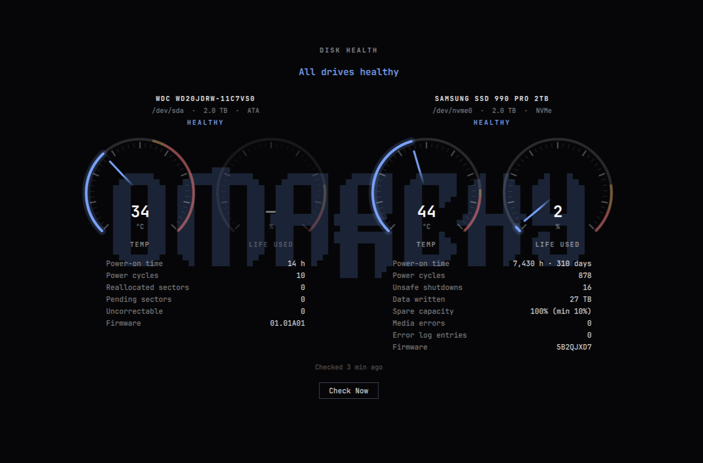

# Disk health for Omarchy

SMART disk-health monitoring for [Omarchy](https://omarchy.org/). It runs an
hourly check of every drive, notifies you when one develops a problem, and has
a panel styled like Omarchy's disk speed test with temperature and lifespan
dials for each drive.

## Install

    omarchy plugin add <repo-url> --enable

Reading SMART data needs root, which a plugin can't get on its own, so there is
a one-time setup. A notification will prompt you; click it (or run
`omarchy-shell shell summon skalawag.disk-health`), press **Set Up**, and enter
your password. After that, open the panel from **Menu → System → Disk Health**.

Your user must be in the `wheel` group for **Check Now** to work without a password.

### What setup installs

| Where | What |
|-------|------|
| pacman | `smartmontools`, if missing |
| `/usr/local/bin/disk-health-collect` | the collector (reads drives, never writes to them) |
| `/usr/local/bin/disk-health-uninstall` | removes all of the system components below |
| `/etc/systemd/system/disk-health.{service,timer}` | runs the collector 2 min after boot and hourly |
| `/etc/systemd/system/disk-health-drivedb.{service,timer}` | weekly, signature-checked update of smartmontools' drive database into `/var/lib/disk-health/drivedb.h` (the packaged copy is left alone) |
| `/etc/polkit-1/rules.d/50-disk-health.rules` | lets `wheel` users start `disk-health.service` without a password |
| `/var/lib/disk-health/` | `status.json` (results), `drivedb.h` (current drive database), `installed.sha256` (what's installed) |
| `~/.config/omarchy/extensions/omarchy-menu.jsonc` | one line for the menu entry (backup made first; hides itself if the plugin is removed) |

Setup runs `system/setup.sh install` from the plugin folder through `pkexec`.
Read it before you run it.

### Updating

    omarchy plugin update skalawag.disk-health

If the update changed the system components, you'll get a notification and the
panel will show an **Update** button.

### Removing

1. In the panel, click **Remove System Components** (twice, to confirm) and authenticate.
2. `omarchy plugin remove skalawag.disk-health`

If you removed the plugin first, `sudo disk-health-uninstall` removes the system
components. `smartmontools` stays installed (`sudo pacman -R smartmontools`), and
the menu line stays (hidden) until you delete it.

## How it works

1. **Collector (root)**: `disk-health.timer` runs `disk-health-collect`, which reads
   every drive with `smartctl --json` and writes `/var/lib/disk-health/status.json`
   (world-readable). Sleeping drives aren't woken; their previous reading is kept.
2. **Alert service** (`Service.qml`): watches the status file and sends a notification
   when a drive gets a *new* problem, when checks have stopped for over 26 hours, or
   when setup or an update is needed. Numbers are ignored when comparing, so 57 → 58 °C
   doesn't re-alert, but growing reallocated sectors does. Notifications stay on screen
   until dismissed; clicking one opens the panel. Already-alerted problems are kept in
   `~/.local/state/disk-health/alerted.json`.
3. **Panel** (`Panel.qml`): per-drive dials and figures. Esc closes it; Enter or
   **Check Now** runs a fresh check.

Only the collector runs as root. The plugin itself never has privileges.

## Thresholds

Set in `system/disk-health-collect`:

| Level    | Condition |
|----------|-----------|
| critical | SMART check failed; NVMe critical warning; NVMe media errors; pending or uncorrectable sectors; an attribute failing now; ≥90% of rated lifespan used; temperature at or above the drive's critical limit |
| warning  | reallocated sectors; spare capacity within 10% of its threshold; an attribute that failed in the past; ≥80% of rated lifespan used; temperature at or above the warning limit |

Temperature limits come from the drive when it reports them, otherwise 70/80 °C
(NVMe) and 55/60 °C (others). Drives that can't report SMART (some USB enclosures
hide it) show as "No SMART data" and never alert.

## Hardware coverage

**Status: 0.9, beta.** Tested on real hardware with an NVMe SSD and a USB-attached
SATA hard drive; other drive types are covered by the test fixtures below and by
the design, not yet by real-world use.

The design choices that matter for drives nobody here has tried:

- **The drive's own verdict comes first.** SMART pass/fail and the NVMe critical
  warning flags are standard across vendors.
- **Attributes are read by name, not number.** smartctl names each attribute from
  its [drive database](https://www.smartmontools.org/wiki/DriveDB), which a weekly
  timer keeps current. The same number can mean different things on different
  drives (231 is lifespan on some SSDs and a controller temperature on others), so
  lifespan is only shown when the vendor-neutral endurance indicator or a known
  wear attribute name is present. Otherwise the dial shows a dash rather than a guess.
- **One odd drive can't break the rest.** A drive whose data can't be understood
  shows as unavailable with a note; every other drive is still checked.

### Reporting a drive

If a drive shows something wrong, or "Couldn't read this drive", please open an
issue with the output of:

    sudo disk-health-collect --report > disk-health-report.json

It contains smartctl's raw data for every drive and what the plugin concluded,
with serial numbers and WWNs removed. Look it over before posting.

## Development

    tests/run.sh                  # collector against fake drives and fixtures, manifest validation
    ./install.sh                  # deploy this working copy, incl. uncommitted edits
    ./uninstall.sh                # remove everything (the repo stays)
    omarchy-shell diskhealth simulate   # fake alert → click → panel
    omarchy-shell diskhealth status     # what the alert service last saw
    omarchy-shell shell summon skalawag.disk-health '{"statusPath":"/path/to/status.json"}'

`tests/fixtures/` holds `--report` files that `tests/replay-smartctl` feeds back
through the collector, each with an `expect` block (per device: `status`,
`life_used_pct`, `note_contains`). A drive from a bug report becomes a test by
saving its report there and adding the expectation.

`install.sh` refuses to overwrite a copy installed with `omarchy plugin add`; use
`omarchy plugin update` for that, or remove it first.

## License

MIT; see [LICENSE](LICENSE).
